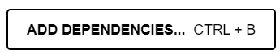
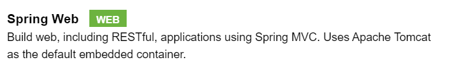
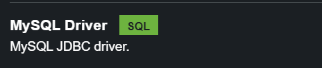
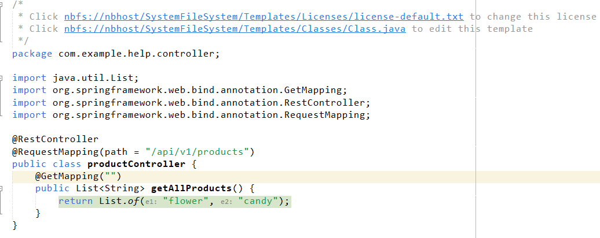
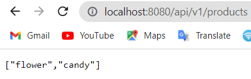
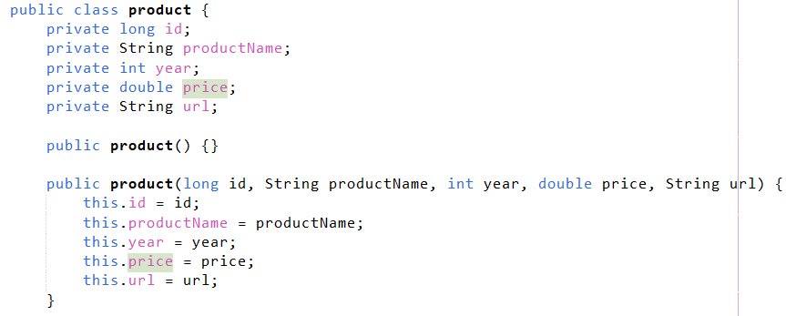
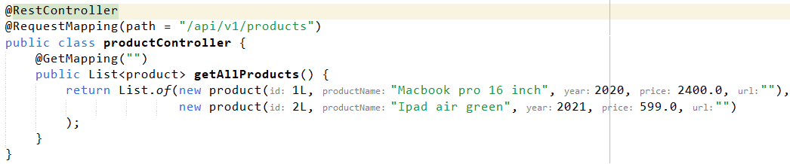
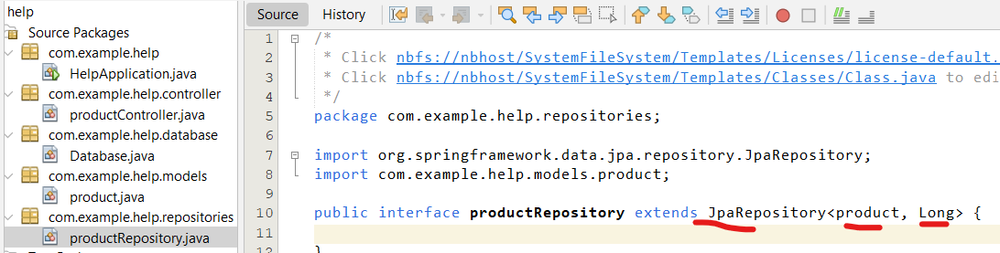
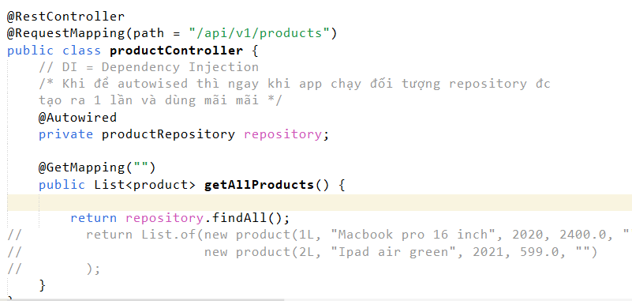
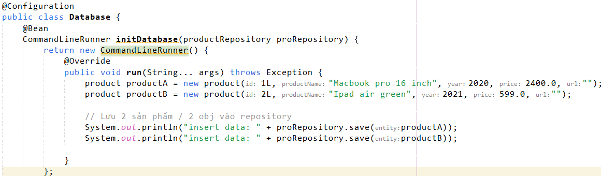

# link tham khảo

**Link tham khảo tạo ra những api đơn giản đầu tiên:
<https://www.youtube.com/watch?v=UMePnyjr6FM&t=531s>**

**Link tham khảo kết nối CSDL:**

**<https://www.youtube.com/watch?v=LKokynxtXeY>**

**Bước 1: Truy cập vào <https://start.spring.io/>**

\- Project thì chọn Maven

"demo" là tên của project mình có thể
thay thế nó.

\- Thêm các cái dependencies vào: Chọn

Sau đó chọn những dependencies này.

\- Sau đó nhấn generate thì ta sẽ tải đc dự án về dưới dạng file zip

**Bước 2: Mở project**

\- unzip cái file đó ra. Sau đó open project bằng netbeans

\- Nhấp chuột phải lên project vd project có tên là help -\> chọn
properties ở dưới cùng.

\- Sau đó chọn categories **Run -\>** nhấn Browse để chọn main class.

\- tạo ra file index.html trong package static

\- tạo ra package controller (package này phải nằm trong package chứa
class chính sẽ chạy của project).

\- Tạo class productController trong package vừa tạo.

Trong class productController

\- Thêm annotation \@RestController để báo cho Java Spring biết đây là
controller.

\- Thêm annotation \@RequestMapping để tạo các định tuyến.

Sau khi run project thì: truy cập vào
<http://localhost:8080/api/v1/products>

Sẽ thấy kết quả:

**Bước 3: Tạo model**

\- Objects đc tạo ra mà có đủ constructor rồi getter, setter thì nó còn
được gọi là POJO - Plain Old Java Object.

\- Từ POJO sẽ convert sang dạng JSON để trả về cho client biết

**Bước 4: Tạo database**

Trong Java, \"\@configuration\" là một annotation được sử dụng để đánh
dấu một class là một cấu hình Spring Configuration. Các lớp được đánh
dấu bằng \"\@configuration\" chứa các phương thức được đánh dấu bằng
\"\@bean\" để chỉ định các bean mà Spring sẽ quản lý.

Annotation \"\@configuration\" cho phép Spring biết rằng class được đánh
dấu sẽ cung cấp các cấu hình cho ứng dụng, và các phương thức được đánh
dấu \"\@bean\" trong class đó cung cấp các đối tượng bean mà Spring sẽ
tạo và quản lý.

\@bean method sẽ được gọi ngày khi ứng dụng chạy.

\@bean method này chúng ta dùng để khởi tạo database, biến môi trường,
...

**Bước 5: tạo repositories -- nơi chứa các hàm lấy dữ liệu về từ memory,
file text, từ database**

Các hàm CRUD có sẵn trong Jpa không cần viết lại.

Product là kiểu của cái thực thể hay cái model

Long là kiểu của khóa chính Primary key

**Khái niệm mới: Dependency Injection** là một kỹ thuật lập trình trong
Java, cho phép một đối tượng được cung cấp các dependency của nó bởi một
bên thứ ba, thay vì được tạo ra bên trong đối tượng đó.

Trong Dependency Injection, các đối tượng không tạo hoặc quản lý các
dependency của chính nó, mà được cung cấp chúng từ bên ngoài thông qua
các cơ chế như Constructor Injection, Setter Injection hoặc Field
Injection.

Trong class database có phương thức initDatabase tạo ra một số database
fake ban đầu cho database của chúng ta.

**CommandLineRunner** là một interface

\- tạo ra một đối tượng thực thi interface này cụ thể là thực thi hàm
run

Nếu chúng ta có database rồi thì bỏ cái này đi

Đối tượng logger dùng để thay cho system.out.printl

Hiện thông tin của các cái class mà chúng ta truyền vào (thông tin chi
tiết function, ...)

<https://stackoverflow.com/questions/31134333/this-application-has-no-explicit-mapping-for-error>
